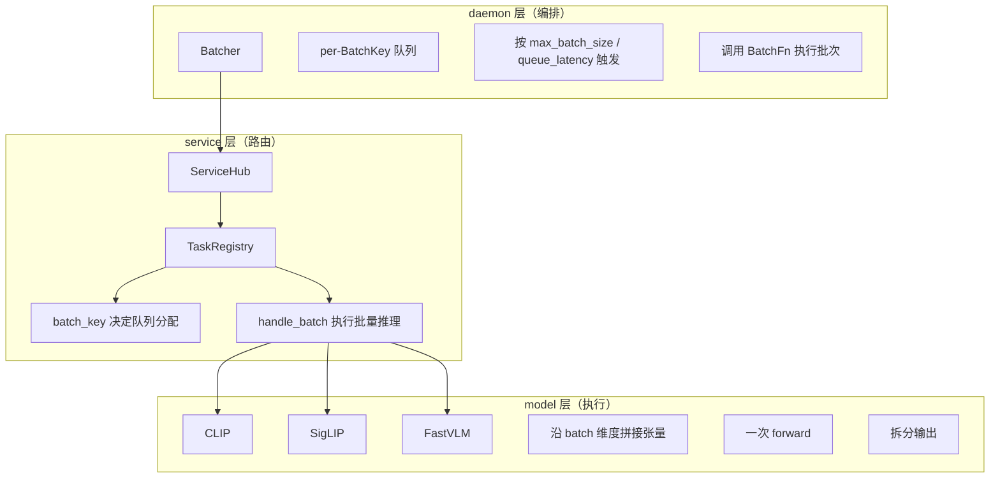
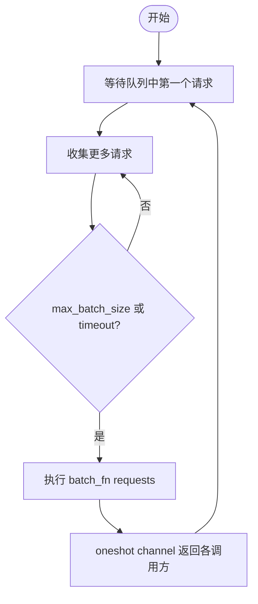

# 批处理设计

动态批处理是 Lumen Hub 的核心性能特性，允许将多个兼容的推理请求合并为一个批次执行，提升 GPU/ONNX 吞吐。

## 设计目标

- **零侵入**：不强迫所有任务参与批处理。`TaskHandler` 提供默认的 `batch_key() → None`（即"不参与"）
- **可配置**：通过 `BatchingConfig` 控制开关、批次大小、等待时长
- **按需分组**：不同模型/任务的请求自动隔离，不会混批

## 两层架构



## BatchKey：分组的核心

`BatchKey` 是一个字符串标识，决定哪些请求可以合并。同一 `BatchKey` 的请求 = 同一服务 + 同一任务 + 相同形状/数据类型的张量。

生成过程（以 CLIP 为例）：

```
grpc.rs:
  task_key = hub.batch_key("clip", "image_embed", request)
  batch_key = BatchKey::new(format!(
      "service=clip\ntask=image_embed\n{}",
      task_key.as_str()
  ))
```

`task_key` 由 `ClipImageEmbedTask::batch_key()` 生成，包含模型 ID、版本、张量形状、数据类型——确保只有**完全兼容**的请求才合并。

## BatchFn：执行回调

`Batcher` 不直接知道如何执行推理。它通过 `BatchFn` 回调执行：

```rust
type BatchFn = Arc<dyn Fn(Vec<TaskRequest>) -> Pin<Box<dyn Future<Output = ServiceResult<Vec<TaskResult>>> + Send>> + Send + Sync>;
```

`grpc.rs` 创建 `BatchFn` 时捕获了 `Arc<ServiceHub>`、`service_name`、`task_name`，触发时直接调用 `hub.handle_batch()`。

## 触发条件

批次在满足以下**任一**条件时触发：

1. **数量条件**：队列长度达到 `config.max_batch_size`
2. **时间条件**：第一个请求入队后等待超过 `config.queue_latency_ms`

实现逻辑（`batcher.rs:run()`）：



## 配置

```json
{
  "server": {
    "batching": {
      "enabled": true,
      "max_batch_size": 8,
      "queue_latency_ms": 2
    }
  }
}
```

| 字段 | 默认值 | 说明 |
|---|---|---|
| `enabled` | `true` | 全局批处理开关。关闭后所有请求走单请求路径 |
| `max_batch_size` | `8` | 单批次最大请求数 |
| `queue_latency_ms` | `2` | 首个请求入队后最多等待的毫秒数 |

## 批处理 vs 不批处理

| 场景 | 走批处理？ | 原因 |
|---|---|---|
| 预处理好的张量 (`preprocess.skip=true`) | ✅ | 形状已知、可直接拼接 |
| 原始图片 (`image/jpeg`) | ❌ | 预处理开销不均、无法安全拼接 |
| 原始文本 | ❌ | tokenize 后序列长度不同、需要 padding |
| 模型未实现 `batch_key()` | ❌ | 返回 `None`，默认不参与 |
