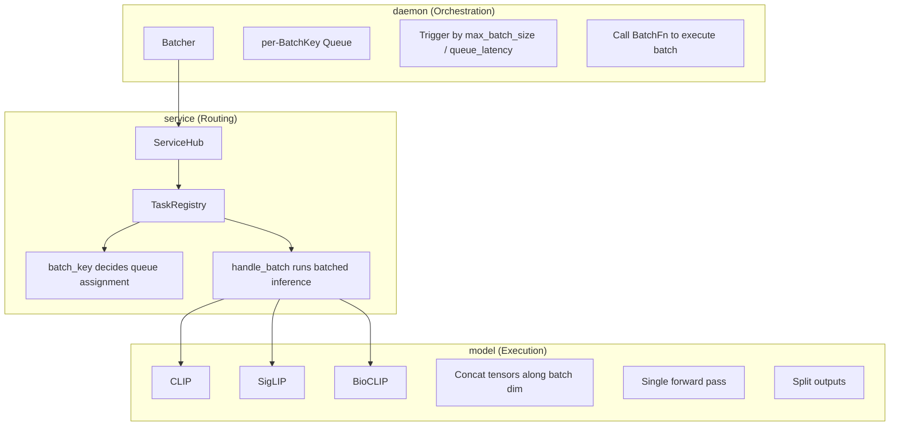

# Batching Design

Dynamic batching is a core performance feature of Lumen Hub. It merges compatible inference requests into a single batch, improving GPU/ONNX throughput.

## Design Goals

- **Zero-intrusion**: Not all tasks must participate. `TaskHandler` defaults `batch_key()` to `None` ("opt out")
- **Configurable**: The `BatchingConfig` controls the on/off switch, batch size, and wait time
- **On-demand grouping**: Requests for different models/tasks are isolated — no cross-contamination

## Two-Layer Architecture



## BatchKey: Grouping Core

`BatchKey` is a string identifier that determines which requests can merge. Same `BatchKey` = same service + same task + same tensor shape/dtype.

Generation (SigLIP image embed example):

```
grpc.rs:
  task_key = hub.batch_key("siglip", "semantic_image_embed", request)
  batch_key = BatchKey::new(format!(
      "service=siglip\ntask=semantic_image_embed\n{}",
      task_key.as_str()
  ))
```

`task_key` is produced by the task's `batch_key()` and includes model ID, tensor shape, and dtype — ensuring only **fully compatible** requests are merged.

## BatchFn: Execution Callback

`Batcher` does not know how to run inference directly. It delegates via the `BatchFn` callback:

```rust
type BatchFn = Arc<dyn Fn(Vec<TaskRequest>) -> Pin<Box<dyn Future<Output = ServiceResult<Vec<TaskResult>>> + Send>> + Send + Sync>;
```

In `grpc.rs`, the `BatchFn` captures `Arc<ServiceHub>`, `service_name`, and `task_name`. When triggered, it calls `hub.handle_batch()`.

## Trigger Conditions

A batch fires when **either** condition is met:

1. **Size**: Queue length reaches `config.max_batch_size`
2. **Time**: First request has waited longer than `config.queue_latency_ms`

Implementation (`batcher.rs:run()`):

```mermaid
flowchart TD
    Start([Start]) --> Wait[Wait for first request in queue]
    Wait --> Collect[Collect more requests]
    Collect --> Check{max_batch_size or timeout?}
    Check -->|No| Collect
    Check -->|Yes| Execute[Execute batch_fn(requests)]
    Execute --> Respond[Return via oneshot channel to each caller]
    Respond --> Wait
```

## Config

```json
{
  "server": {
    "batching": {
      "enabled": true,
      "max_batch_size": 8,
      "queue_latency_ms": 2
    }
  }
}
```

| Field | Default | Description |
|---|---|---|
| `enabled` | `true` | Global batching toggle. When off, all requests go through the single-request path |
| `max_batch_size` | `8` | Maximum requests per batch |
| `queue_latency_ms` | `2` | Max milliseconds to wait after the first request enqueues |

## Batching vs. Non-Batching

| Scenario | Batched? | Reason |
|---|---|---|
| Embedding image tensors (`preprocess.skip=true`, fixed shape) | ✅ | Shapes known, single forward, directly concatenable |
| BioCLIP classify image tensors | ✅ | Same vision encoder batching as CLIP |
| Raw images (`image/jpeg`) | ❌ | Uneven preprocessing cost, unsafe to concatenate |
| Raw text | ❌ | Tokenized sequences vary in length, need padding |
| OCR / face recognition (multi-stage pipelines) | ❌ | Dynamic shapes and variable instance counts |
| Model doesn't implement `batch_key()` | ❌ | Returns `None`, opts out by default |

See [Task Input Contract](./task-input.md) for tensor metadata requirements.
