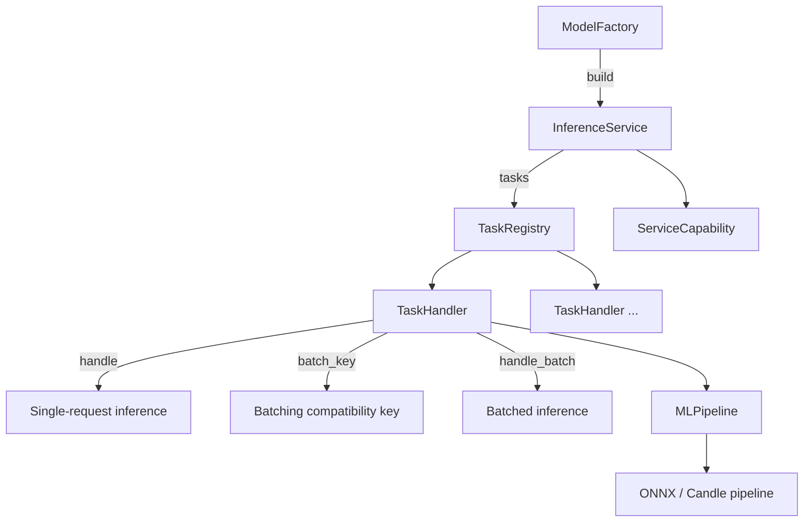
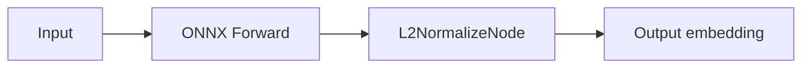

# Model Integration Pattern

Every model in Lumen Hub follows the same integration pattern: **Factory → Service → Pipeline → Task**.

## Pattern Overview



## 1. ModelFactory (`factory.rs`)

Implements the `ModelFactory` trait. Responsibilities:
- Discover and load model files
- Select device (CPU/CUDA/Metal)
- Set model context (input/output names, dtype, shape constraints)

```rust
impl ModelFactory for ClipModelFactory {
    fn build(&self, config: &str, context: Arc<MLContext>) -> ServiceResult<InferenceServiceInstance> {
        // Load ONNX model → create ClipService
    }
}
```

## 2. InferenceService (`service.rs`)

The entry point for a service. Implements the `InferenceService` trait:

```rust
pub trait InferenceService: Send + Sync {
    fn name(&self) -> &str;
    fn capability(&self) -> ServiceCapability;
    fn tasks(&self) -> Arc<TaskRegistry>;
}
```

One `InferenceService` can contain multiple tasks (e.g., CLIP image embedding + text embedding).

## 3. Pipeline (`pipeline.rs`)

Connects model forward pass and postprocessing nodes into an `MLPipeline`:



Pipeline is provided by `lumnn` and supports ONNX and Candle backends.

## 4. TaskHandler (`task.rs`)

Each task implements the `TaskHandler` trait:

```rust
pub trait TaskHandler: Send + Sync {
    fn spec(&self) -> &TaskSpec;

    // Default: returns None (opts out of batching)
    fn batch_key(&self, request: &TaskRequest) -> ServiceResult<Option<BatchKey>> {
        Ok(None)
    }

    async fn handle(&self, request: TaskRequest) -> ServiceResult<TaskResult>;

    // Default: calls handle() one by one
    async fn handle_batch(&self, requests: Vec<TaskRequest>) -> ServiceResult<Vec<TaskResult>> {
        let mut results = Vec::with_capacity(requests.len());
        for request in requests {
            results.push(self.handle(request).await?);
        }
        Ok(results)
    }
}
```

**To support batching, a model must override two methods:**

- `batch_key()` — Returns tensor shape/dtype/model identifier, ensuring only compatible requests merge
- `handle_batch()` — Concatenate tensors along the batch dimension, run one forward pass, split results

## Existing Models

| Model | Tasks | Batching | Backend |
|---|---|---|---|
| CLIP | `image_embed`, `text_embed` | ✅ Image tensors | ONNX |
| SigLIP | `image_embed`, `text_embed` | ✅ Image tensors | ONNX |
| FastVLM | Planning | Planning | — |

## Checklist for Adding a New Model

1. Create directory at `models/<name>/`
2. Implement `ModelFactory` (load model, create device context)
3. Implement `InferenceService` (wrap `TaskRegistry`)
4. Implement `Pipeline` (compose forward + postprocessing nodes)
5. Implement `TaskHandler` (single-request inference; optionally override `batch_key` + `handle_batch`)
6. Add module in `models/mod.rs`
7. Add feature gate in `Cargo.toml`
8. Register service name in `LumenConfig`
