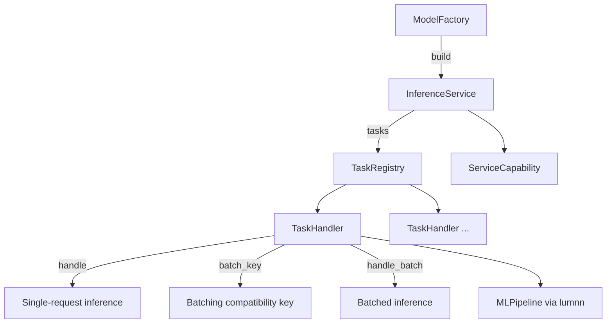

# Model Integration Pattern

Every model follows the same integration pattern: **Factory → Service → Pipeline → Task**.

## Pattern overview



## 1. Service construction (`service.rs`)

`ClipService::from_config`, `SiglipService::from_config`, etc.:

- Load `model_info.json` from `{cache_dir}/{model}/`
- Parse model-specific `task_metadata`
- Build `MLPipeline` per task
- Register `TaskHandler` instances on a `TaskRegistry`

## 2. InferenceService

```rust
pub trait InferenceService: Send + Sync {
    fn name(&self) -> &str;
    fn capability(&self) -> ServiceCapability;
    fn tasks(&self) -> Arc<TaskRegistry>;
}
```

One service can expose multiple tasks (for example SigLIP `semantic_text_embed` + `semantic_image_embed`).

## 3. Pipeline (`pipeline.rs`)

Connects forward nodes and postprocessing (for example L2 normalize) in `lumnn::MLPipeline`.

Backends come from `MLContext` (ONNX or MNN session per component).

## 4. TaskHandler (`task.rs`)

```rust
pub trait TaskHandler: Send + Sync {
    fn spec(&self) -> &TaskSpec;
    fn batch_key(&self, request: &TaskRequest) -> ServiceResult<Option<BatchKey>> { Ok(None) }
    async fn handle(&self, request: TaskRequest) -> ServiceResult<TaskResult>;
    async fn handle_batch(&self, requests: Vec<TaskRequest>) -> ServiceResult<Vec<TaskResult>> { ... }
}
```

Override `batch_key` and `handle_batch` to participate in daemon batching.

## Shipped models (beta)

| Package | Service key (typical) | Tasks | Batching | Backend |
|---|---|---|---|---|
| `clip` | `bioclip` | `bioclip_classify` | image tensors | ONNX / MNN |
| `clip` | custom | `semantic_text_embed`, `semantic_image_embed` | image tensors | ONNX / MNN |
| `siglip` | `siglip` | `semantic_text_embed`, `semantic_image_embed` | image tensors | ONNX / MNN |
| `ppocr` | `ocr` | `ocr` | no | ONNX only |
| `insightface` | `face` | `face_recognition` | no | ONNX / MNN |

BioCLIP uses the `clip` package with a `dataset` field on the model config; see [BioCLIP](../models/bioclip.md).

## Checklist for adding a model

1. Create `crates/lumen-hub/src/models/<name>/`
2. Add `model_info.example.json` under `crates/lumen-hub/tools/<name>/`
3. Implement service + task handlers
4. Register `mod` and Cargo feature in `lumen-hub`
5. Add package name to hub `main.rs` match and beta dist profile features
6. Publish model repo under `Lumilio-Photos/{model}` — [Model Repository Spec](../development/model-repository.md)
