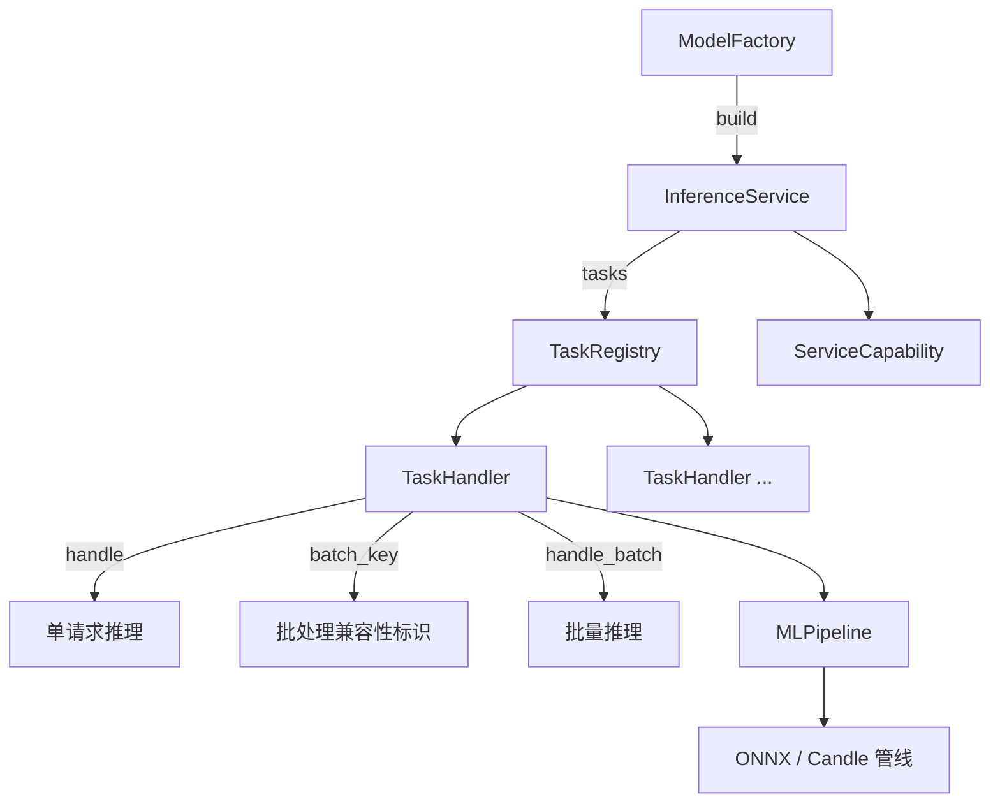

# 模型集成模式

每个模型在 Lumen Hub 中遵循统一的集成模式：**Factory → Service → Pipeline → Task**。

## 模式概览



## 1. ModelFactory (`factory.rs`)

实现 `ModelFactory` trait，负责：
- 模型文件发现和加载
- 设备选择（CPU/CUDA/Metal）
- 设置模型上下文（输入/输出名称、dtype、形状约束）

```rust
impl ModelFactory for ClipModelFactory {
    fn build(&self, config: &str, context: Arc<MLContext>) -> ServiceResult<InferenceServiceInstance> {
        // 加载 ONNX 模型 → 创建 ClipService
    }
}
```

## 2. InferenceService (`service.rs`)

服务的入口点，实现 `InferenceService` trait：

```rust
pub trait InferenceService: Send + Sync {
    fn name(&self) -> &str;
    fn capability(&self) -> ServiceCapability;
    fn tasks(&self) -> Arc<TaskRegistry>;
}
```

一个 `InferenceService` 可以包含多个任务（如 CLIP 的图像嵌入 + 文本嵌入）。

## 3. Pipeline (`pipeline.rs`)

将模型 forward + 后处理节点连接成 `MLPipeline`：


Pipeline 由 `lumnn` 提供，支持 ONNX 和 Candle 后端。

## 4. TaskHandler (`task.rs`)

每个任务实现 `TaskHandler` trait：

```rust
pub trait TaskHandler: Send + Sync {
    fn spec(&self) -> &TaskSpec;

    // 默认返回 None（不参与批处理）
    fn batch_key(&self, request: &TaskRequest) -> ServiceResult<Option<BatchKey>> {
        Ok(None)
    }

    async fn handle(&self, request: TaskRequest) -> ServiceResult<TaskResult>;

    // 默认逐个调用 handle()
    async fn handle_batch(&self, requests: Vec<TaskRequest>) -> ServiceResult<Vec<TaskResult>> {
        let mut results = Vec::with_capacity(requests.len());
        for request in requests {
            results.push(self.handle(request).await?);
        }
        Ok(results)
    }
}
```

**要支持批处理，模型需要覆盖两个方法**：

- `batch_key()` — 返回张量形状/数据类型/模型标识，确保只有兼容的请求合并
- `handle_batch()` — 沿 batch 维度拼接张量，一次 forward，拆分结果

## 现有模型

| 模型 | 任务 | 支持批处理 | 后端 |
|---|---|---|---|
| CLIP | `image_embed`, `text_embed` | ✅ 图像张量 | ONNX |
| SigLIP | `image_embed`, `text_embed` | ✅ 图像张量 | ONNX |
| FastVLM | 规划中 | 规划中 | — |

## 添加新模型清单

1. 在 `models/<name>/` 创建目录
2. 实现 `ModelFactory`（加载模型、创建设备上下文）
3. 实现 `InferenceService`（包装 `TaskRegistry`）
4. 实现 `Pipeline`（拼接 forward + 后处理节点）
5. 实现 `TaskHandler`（单请求推理；可选覆盖 `batch_key` + `handle_batch`）
6. 在 `models/mod.rs` 添加模块
7. 在 `Cargo.toml` 添加 feature gate
8. 在 `LumenConfig` 中注册服务名
