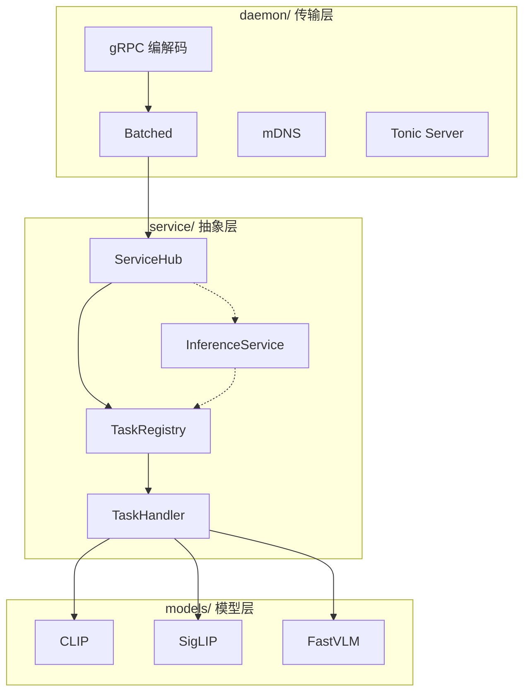

# 架构概览

Lumen Hub 采用三层架构，上层依赖下层，下层完全不感知上层。

## 分层图



## daemon/ — 传输层

**关心的东西**：gRPC chunk 组装、`TaskRequest` 反序列化、批处理队列、mDNS 广播、Tonic 服务器生命周期。

**不关心的东西**：请求里是什么模型、数据怎么预处理、推理怎么跑。

关键组件：

| 文件 | 职责 |
|---|---|
| `server.rs` | 绑定地址、注册 gRPC service → 启动 Tonic Server |
| `grpc.rs` | 实现 `Inference` trait：组装流式 chunk → `TaskRequest` → 路由到 ServiceHub |
| `batcher.rs` | 维护 per-BatchKey 的请求队列，按 `max_batch_size` / `queue_latency` 触发批次执行 |
| `mdns.rs` | 通过 mDNS-SD 广播 `_lumen._tcp` 服务，客户端可自动发现 |

## service/ — 抽象层

**关心的东西**：服务注册和查找、任务路由、`BatchKey` 生成（用于批处理分组）。

**不关心的东西**：网络协议、模型的具体实现。

关键组件：

| 文件 | 职责 |
|---|---|
| `hub.rs` (`ServiceHub`) | 持有 `HashMap<service_name, Arc<dyn InferenceService>>`，按服务名/任务名路由请求 |
| `registry.rs` (`TaskRegistry`) | 持有 `HashMap<task_name, Arc<dyn TaskHandler>>`，每个 model service 注册自己的任务 |
| `service.rs` (`InferenceService`) | Trait：`name()` + `capability()` + `tasks()` |
| `task.rs` (`TaskHandler`) | Trait：`spec()` + `handle()` + `batch_key()` + `handle_batch()` |
| `factory.rs` (`ModelFactory`) | Trait：标准化模型构建流程 |

## models/ — 模型层

**关心的东西**：ONNX/Candle 模型加载、图像/文本预处理、推理执行、后处理（如 L2 归一化）。

**不关心的东西**：上层路由、传输协议。

每个模型遵循统一的目录结构：

```
models/<name>/
  factory.rs   → ModelFactory 实现
  service.rs   → InferenceService 实现
  pipeline.rs  → 推理管线构建
  nodes.rs     → 自定义处理节点（如 L2 归一化）
  task.rs      → TaskHandler 实现（支持单请求 + 批量推理）
```

## 依赖方向

```
main.rs
  → LumenConfig（schema 层）
  → daemon::serve_grpc（启动服务）
    → HubGrpcService（持有 ServiceHub + Batcher）
      → ServiceHub::handle / handle_batch
        → TaskRegistry::handle / handle_batch
          → TaskHandler（在 models/ 中实现）

跨层依赖都是通过 Arc<dyn Trait> 注入，不依赖具体类型。
```
