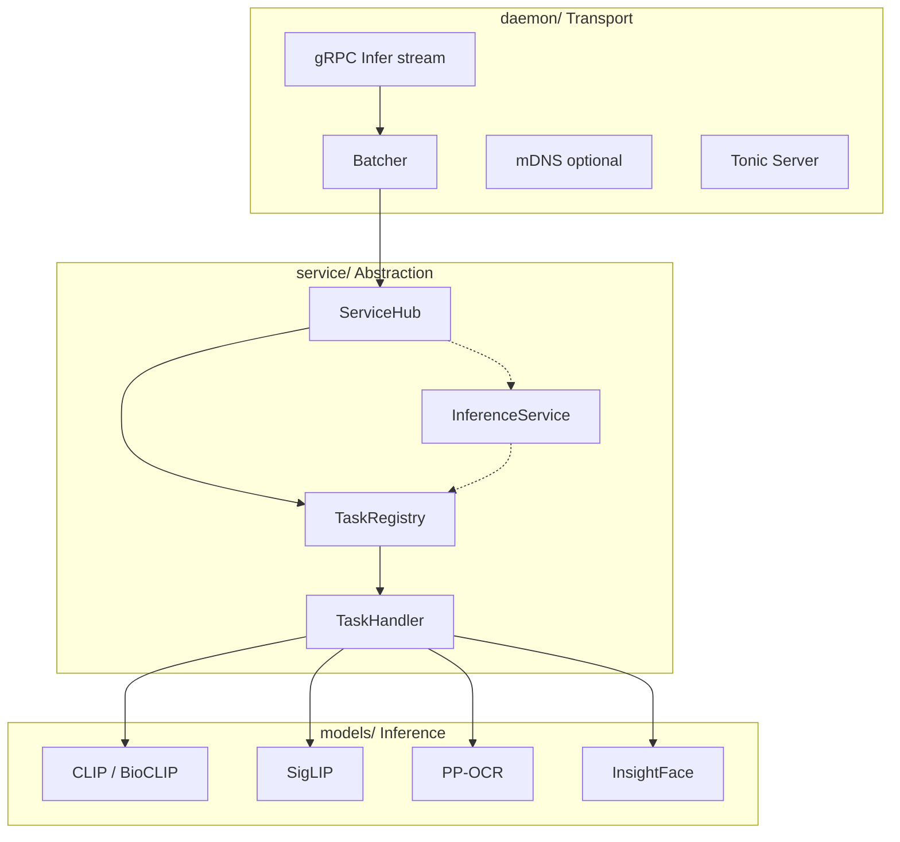

# Architecture Overview

Lumen Hub uses a three-layer architecture inside `crates/lumen-hub`. Upper layers depend on lower ones; lower layers are unaware of layers above.

## Layer diagram



## daemon/ — Transport layer

**Concerns**: gRPC chunk assembly, `TaskRequest` construction, batching queue, optional mDNS, Tonic server lifecycle.

**Ignores**: Model-specific preprocessing and inference.

| Module | Responsibility |
|---|---|
| `server.rs` | Bind address, register gRPC service, shutdown |
| `grpc.rs` | `Infer` streaming → `TaskRequest` → `ServiceHub` / `Batcher` |
| `batcher.rs` | Per-`BatchKey` queues; flush on size or latency |
| `mdns.rs` | Advertise `_lumen._tcp` when enabled |
| `proto.rs` / `home_native.v1.rs` | Generated from `proto/ml_service.proto` |

## service/ — Abstraction layer

**Concerns**: Service registration, task routing, `BatchKey` generation.

**Ignores**: Network protocols and concrete model weights.

| Module | Responsibility |
|---|---|
| `hub.rs` | `HashMap<service_name, Arc<dyn InferenceService>>` |
| `registry.rs` | `HashMap<task_name, Arc<dyn TaskHandler>>` |
| `service.rs` | `InferenceService` trait |
| `task.rs` | `TaskHandler` trait (`handle`, `batch_key`, `handle_batch`) |
| `factory.rs` | `ModelFactory` trait for legacy construction paths |
| `tensor.rs` | Tensor metadata keys and preprocess ID constants |

## models/ — Model layer

**Concerns**: `model_info.json` parsing, artifact loading via `lumnn`, preprocessing, inference, postprocessing.

**Ignores**: gRPC and hub routing.

```
models/<name>/
  mod.rs
  factory.rs / service.rs
  pipeline.rs
  nodes.rs      # optional
  task.rs
```

Beta models: `clip` (includes BioCLIP classify), `siglip`, `ppocr`, `insightface`.

## lumnn — Runtime layer

`lumnn` (separate crate) provides `MLContext`, `MLPipeline`, and backends:

- **ONNX Runtime** — default in beta dist profiles
- **MNN** — optional; bundled on some profiles (for example `darwin-arm64` Metal)
- **Candle** — optional compile-time feature, not in beta dist bundles

Model services build pipelines from `lumnn` nodes; runtime selection comes from config `runtime: onnx | mnn`.

## Dependency direction

```
main.rs
  → LumenConfig (lumen-schema)
  → ensure_models_for_config
  → build_service_hub_from_config
  → serve_grpc_with_shutdown(HubGrpcService)
    → ServiceHub::handle / handle_batch
      → TaskHandler (models/)
```

Cross-layer coupling uses `Arc<dyn Trait>` — no concrete type coupling between daemon and models.
