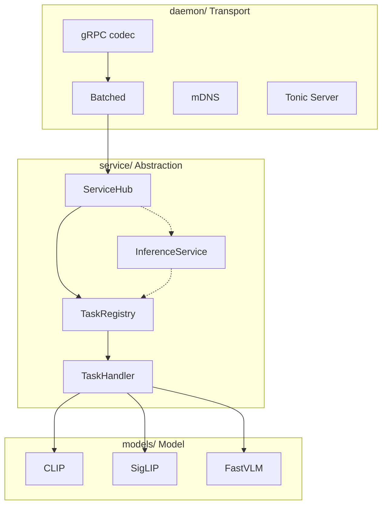

# Architecture Overview

Lumen Hub uses a three-layer architecture. Upper layers depend on lower ones; lower layers are completely unaware of the layers above.

## Layer Diagram



## daemon/ — Transport Layer

**Concerns**: gRPC chunk assembly, `TaskRequest` deserialization, batching queue, mDNS broadcast, Tonic server lifecycle.

**Ignores**: What model the request is for, how data is preprocessed, how inference runs.

Key components:

| File | Responsibility |
|---|---|
| `server.rs` | Bind address, register gRPC service → start Tonic Server |
| `grpc.rs` | Implement `Inference` trait: assemble streaming chunks → `TaskRequest` → route to ServiceHub |
| `batcher.rs` | Maintain per-BatchKey request queues; trigger batch execution when `max_batch_size` / `queue_latency` fires |
| `mdns.rs` | Advertise `_lumen._tcp` service via mDNS-SD — clients can auto-discover |

## service/ — Abstraction Layer

**Concerns**: Service registration and lookup, task routing, `BatchKey` generation (for batching groups).

**Ignores**: Network protocols, concrete model implementations.

Key components:

| File | Responsibility |
|---|---|
| `hub.rs` (`ServiceHub`) | Holds `HashMap<service_name, Arc<dyn InferenceService>>`; routes requests by service/task name |
| `registry.rs` (`TaskRegistry`) | Holds `HashMap<task_name, Arc<dyn TaskHandler>>`; each model service registers its own tasks |
| `service.rs` (`InferenceService`) | Trait: `name()` + `capability()` + `tasks()` |
| `task.rs` (`TaskHandler`) | Trait: `spec()` + `handle()` + `batch_key()` + `handle_batch()` |
| `factory.rs` (`ModelFactory`) | Trait: standardised model construction flow |

## models/ — Model Layer

**Concerns**: ONNX/Candle model loading, image/text preprocessing, inference execution, postprocessing (e.g. L2 normalisation).

**Ignores**: Upper-layer routing, transport protocols.

Each model follows a uniform directory layout:

```
models/<name>/
  factory.rs   → ModelFactory impl
  service.rs   → InferenceService impl
  pipeline.rs  → Inference pipeline construction
  nodes.rs     → Custom processing nodes (e.g. L2 normalisation)
  task.rs      → TaskHandler impl (single-request + batch inference)
```

## Dependency Direction

```
main.rs
  → LumenConfig (schema layer)
  → daemon::serve_grpc (start server)
    → HubGrpcService (holds ServiceHub + Batcher)
      → ServiceHub::handle / handle_batch
        → TaskRegistry::handle / handle_batch
          → TaskHandler (implemented in models/)

Cross-layer dependencies are injected via Arc<dyn Trait> — no concrete type coupling.
