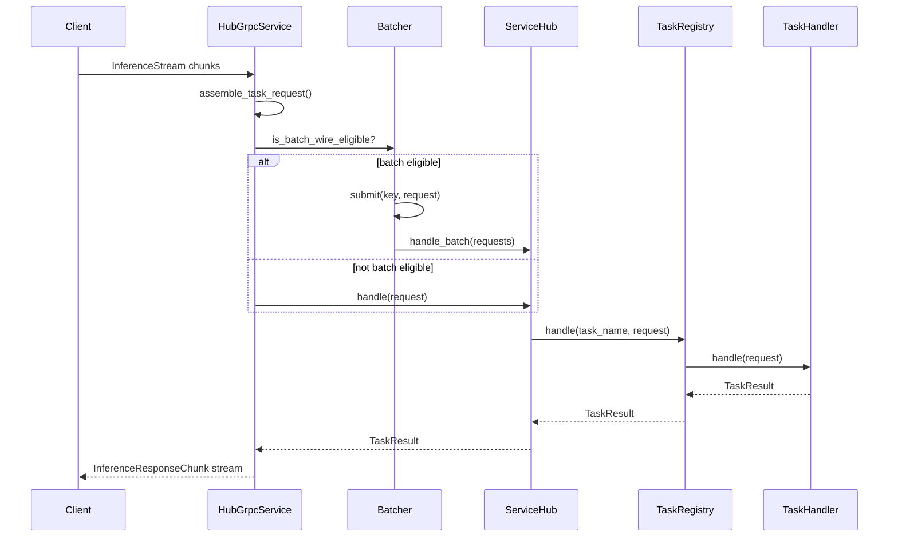
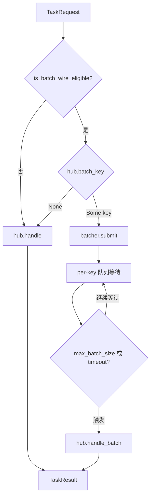
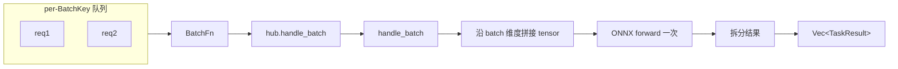

# 请求生命周期

以下追踪一个推理请求从 gRPC 入站到返回响应的完整路径。

## 阶段 1：流式组装

gRPC 客户端通过 `InferenceStream` 双向流发送请求。每个 `InferenceRequestChunk` 携带：

- `correlation_id` — 关联 ID，同一请求的所有 chunk 共享
- `payload` — 数据块字节
- `meta` — 元数据（`service`、`lumen.input.kind`、`lumen.preprocess.skip` 等）
- `chunk_index` / `chunk_count` — 分块序号和总数

服务端在 `grpc.rs:handle_messages` 中收集同一 `correlation_id` 的所有 chunk，拼接 payload，合并 meta（取第一个 chunk），调用 `assemble_task_request` 得到完整的 `TaskRequest`。



## 阶段 2：批处理判断

`HubGrpcService::handle_task_request` 检查是否进入批处理：



批处理准入条件（`grpc.rs:is_batch_wire_eligible`）：

1. `server.batching.enabled == true`
2. `lumen.input.kind == "tensor"`
3. `lumen.preprocess.skip == "true"`

只有**已经预处理好的张量**才能批处理。原始图片/文本不批处理，因为预处理开销不均匀。

## 阶段 3：服务路由

`ServiceHub::handle(service_name, task_name, request)`

1. 按 `service_name` 查找 `InferenceService`
2. 调用 `service.tasks().handle(task_name, request)`
3. `TaskRegistry` 按 `task_name` 查找 `TaskHandler`

## 阶段 4：任务执行

以 CLIP 图像嵌入为例：

```
ClipImageEmbedTask::handle(request)
  ├── payload_mime 是图像？
  │     → preprocess_image(payload) → MLPacket → pipeline.run()
  └── payload_mime 是 tensor？
        → tensor_request_to_packet(request) → pipeline.run()

pipeline.run(packets)
  → ONNX model forward
  → L2NormalizeNode
  → embedding 响应
```

## 阶段 5：响应编码

`TaskResult` 返回后，`grpc.rs:task_result_to_responses` 将其编码为 `InferenceResponseChunk` 流（大数据量时分块传输，每块 4MB）。

## 批处理路径

多个请求在 `Batcher` 中按 `BatchKey` 分组，达到 `max_batch_size` 或 `queue_latency` 后触发：



## 关键设计决策

**为什么批处理在 daemon 层而不是 service 层？**

因为 service 层是协议无关的——它只接收 `TaskRequest` 返回 `TaskResult`。批处理的队列管理、超时触发这些是"编排"逻辑，属于传输层的职责。service 层只需要提供 `batch_key()` 表示"我能接受批处理"和 `handle_batch()` 来执行批处理即可。
