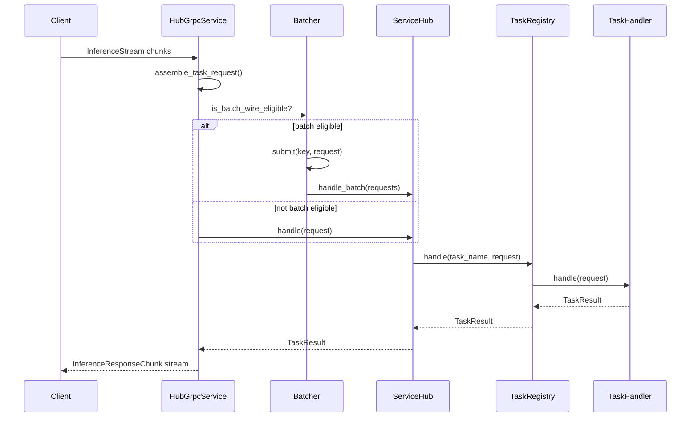
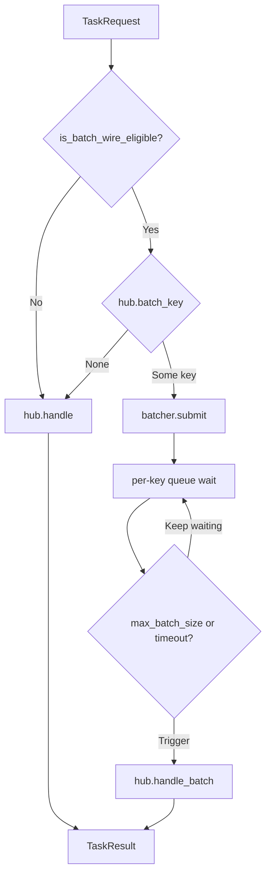
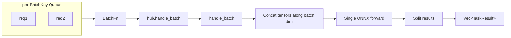

# Request Lifecycle

This document traces an inference request from gRPC ingress to response.

## Stage 1: Streaming Assembly

The gRPC client sends requests over an `InferenceStream` bidirectional stream. Each `InferenceRequestChunk` carries:

- `correlation_id` — Shared by all chunks of the same request
- `payload` — Data chunk bytes
- `meta` — Metadata (`service`, `lumen.input.kind`, `lumen.preprocess.skip`, etc.)
- `chunk_index` / `chunk_count` — Chunk sequence number and total

In `grpc.rs:handle_messages`, the server collects all chunks for the same `correlation_id`, concatenates payloads, merges metadata (taking the first chunk), and calls `assemble_task_request` to produce a complete `TaskRequest`.



## Stage 2: Batching Decision

`HubGrpcService::handle_task_request` checks whether to batch:



Batching eligibility (`grpc.rs:is_batch_wire_eligible`):

1. `server.batching.enabled == true`
2. `lumen.input.kind == "tensor"`
3. `lumen.preprocess.skip == "true"`

Only **preprocessed tensors** are batched. Raw images/text are not — their preprocessing cost is uneven.

## Stage 3: Service Routing

`ServiceHub::handle(service_name, task_name, request)`

1. Look up `InferenceService` by `service_name`
2. Call `service.tasks().handle(task_name, request)`
3. `TaskRegistry` looks up `TaskHandler` by `task_name`

## Stage 4: Task Execution

CLIP image embedding example:

```
ClipImageEmbedTask::handle(request)
  ├── payload_mime is image?
  │     → preprocess_image(payload) → MLPacket → pipeline.run()
  └── payload_mime is tensor?
        → tensor_request_to_packet(request) → pipeline.run()

pipeline.run(packets)
  → ONNX model forward
  → L2NormalizeNode
  → embedding response
```

## Stage 5: Response Encoding

After `TaskResult` is returned, `grpc.rs:task_result_to_responses` encodes it into an `InferenceResponseChunk` stream (chunked at 4 MB for large payloads).

## Batching Path

Multiple requests are grouped by `BatchKey` in the `Batcher`. When `max_batch_size` or `queue_latency` fires:



## Key Design Decision

**Why is batching in the daemon layer instead of the service layer?**

The service layer is protocol-agnostic — it only receives `TaskRequest` and returns `TaskResult`. Queue management and timeout triggering are orchestration logic belonging to the transport layer. The service layer just needs to provide `batch_key()` ("I can batch") and `handle_batch()` ("run this batch").
